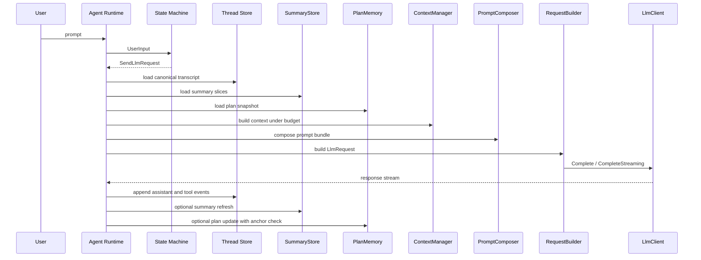

# Agent Go Context Plan Prompt Implementation Checklist

## Goal

Provide an implementation-first playbook for the single-model context architecture:

1. layered context projection
2. recoverable summary memory
3. budget-based request assembly

This document intentionally focuses on execution details and acceptance criteria.

## Scope Guardrails

1. keep canonical thread persistence unchanged
2. do not replace transcript with summaries
3. keep provider-specific prompt behavior below generic runtime layer
4. avoid multi-model orchestration in v1

## Target Module Split

```text
internal/context/
  composer.go
  manager.go
  budget.go
  estimator.go
  selection.go
  types.go

internal/summary/
  store.go
  local_store.go
  invalidation.go
  refresh.go
  types.go

internal/plan/
  memory.go
  local_store.go
  anchor.go
  delta.go
  types.go

internal/runtime/
  request_context.go
  request_builder.go
```

If you prefer fewer packages for v1, merge `summary` and `plan` under `internal/context/` while
keeping interface boundaries unchanged.

## Core Data Contracts

```go
type PromptBundle struct {
    SystemBase     string
    RuntimeRules   string
    ToolProtocol   string
    ProviderPatch  string
    PromptHash     string
}

type RequestBudget struct {
    MaxInputTokens   int
    ReserveForOutput int
    HardCapTokens    int
}

type ContextSelection struct {
    Messages             []Message
    IncludedMessageIDs   []string
    EstimatedInputTokens int
    DroppedReason        []string
}

type PlanAnchor struct {
    ThreadID      string
    ThreadVersion int64
    LastMessageID string
}

type PlanSnapshot struct {
    Anchor        PlanAnchor
    Goal          string
    CurrentStep   string
    OpenQuestions []string
    Todo          []string
}

type SummarySourceRef struct {
    ThreadID       string
    ThreadVersion  int64
    StartMessageID string
    EndMessageID   string
}

type SummarySlice struct {
    ID              string
    ThreadID        string
    Kind            string
    Text            string
    SourceRefs      []SummarySourceRef
    CreatedAtUnixMs int64
}
```

## Runtime Interfaces

```go
type PromptComposer interface {
    Compose(ctx context.Context, profile ModelProfile, tools []ToolSpec) (PromptBundle, error)
}

type ContextManager interface {
    Build(
        ctx context.Context,
        thread Thread,
        turn TurnInput,
        plan PlanSnapshot,
        summaries []SummarySlice,
        budget RequestBudget,
    ) (ContextSelection, error)
}

type SummaryStore interface {
    LoadByThread(ctx context.Context, threadID string) ([]SummarySlice, error)
    Upsert(ctx context.Context, slice SummarySlice) error
    InvalidateFromVersion(ctx context.Context, threadID string, version int64) error
}

type PlanMemory interface {
    Current(ctx context.Context, threadID string) (PlanSnapshot, error)
    Update(ctx context.Context, threadID string, delta PlanDelta, expected PlanAnchor) error
}

type TokenEstimator interface {
    Estimate(messages []Message) (int, error)
    EstimateText(text string) int
}
```

## Implementation Sequence

### Phase 1 Budget and Selection Foundation

1. add `RequestBudget` and `TokenEstimator`
2. add deterministic context selection order
3. include dropped reason reporting

Acceptance criteria:

1. runtime never sends requests above `HardCapTokens`
2. request logs include estimated input tokens
3. dropped reasons are visible in debug logs

### Phase 2 Prompt Composition Blocks

1. implement block-based prompt composer
2. enforce stable merge order (`SystemBase`, `RuntimeRules`, `ToolProtocol`, `ProviderPatch`)
3. compute stable `PromptHash`

Acceptance criteria:

1. same profile and tool set produce same prompt hash
2. provider patch remains optional and isolated

### Phase 3 Plan Memory with Anchor Checks

1. implement local plan store keyed by thread id
2. carry `PlanAnchor` on every snapshot
3. reject stale update when anchor mismatch

Acceptance criteria:

1. stale updates return deterministic conflict error
2. caller path reloads and retries with fresh anchor

### Phase 4 Recoverable Summary Store

1. implement local summary sidecar store
2. require `SourceRefs` on every write
3. invalidate stale slices on rollback or version rewind

Acceptance criteria:

1. no slice can be written without source refs
2. invalidation removes stale ranges deterministically

### Phase 5 Runtime Request Assembly Integration

1. add `BuildRequestContext` runtime stage
2. wire thread load, summary load, plan load, budget compute
3. pass `ContextSelection.Messages` into provider request builder

Acceptance criteria:

1. state machine remains unchanged
2. all context assembly happens in runtime path
3. thread persistence remains turn-complete and shutdown-based

## Priority-Based Selection Algorithm

Use strict tier order:

1. latest user turn and unresolved constraints
2. current plan snapshot
3. recent assistant and tool chain
4. pinned repo policies and instructions
5. relevant summary slices
6. older transcript windows

Drop from lowest-priority tier when budget is exceeded.

## Request Build Pseudocode

```go
func BuildRequestContext(ctx context.Context, in BuildInput) (RequestContext, error) {
    prompt, err := in.PromptComposer.Compose(ctx, in.Profile, in.Tools)
    if err != nil {
        return RequestContext{}, err
    }

    plan, _ := in.PlanMemory.Current(ctx, in.Thread.ID)
    summaries, _ := in.SummaryStore.LoadByThread(ctx, in.Thread.ID)
    budget := ComputeBudget(in.Profile.ModelContextWindow)

    selection, err := in.ContextManager.Build(
        ctx,
        in.Thread,
        in.Turn,
        plan,
        summaries,
        budget,
    )
    if err != nil {
        return RequestContext{}, err
    }

    return RequestContext{
        Prompt:    prompt,
        Selection: selection,
        Plan:      &plan,
        Budget:    budget,
    }, nil
}
```

## Selection Pseudocode

```go
func (cm *DefaultContextManager) Build(
    ctx context.Context,
    thread Thread,
    turn TurnInput,
    plan PlanSnapshot,
    summaries []SummarySlice,
    budget RequestBudget,
) (ContextSelection, error) {
    sel := ContextSelection{}
    remaining := budget.MaxInputTokens - budget.ReserveForOutput

    sel.addLatestUserTurn(turn, &remaining)
    sel.addPlan(plan, &remaining)
    sel.addRecentToolChain(thread.Messages, &remaining)
    sel.addPinnedPolicies(thread.Metadata, &remaining)
    sel.addRelevantSummaries(summaries, &remaining)
    sel.addOlderTranscriptWindows(thread.Messages, &remaining)

    sel.finalizeDroppedReasons()
    return sel, nil
}
```

## End to End Sequence



## Failure Modes and Handling

1. token estimate overflow after build: drop lowest priority tier and rebuild once
2. plan update anchor mismatch: reload snapshot and retry once
3. summary store unavailable: degrade gracefully to transcript-only mode
4. estimator failure: fallback to conservative character-based estimate

## Logging and Observability

Log structured fields on every request build:

1. `thread_id`
2. `thread_version`
3. `prompt_hash`
4. `estimated_input_tokens`
5. `budget_max_input`
6. `budget_reserved_output`
7. `included_message_count`
8. `dropped_reasons`

Never include raw secret values in logs.

## Test Checklist

1. unit test prompt hash stability
2. unit test tiered selection order
3. unit test drop behavior under tight budget
4. unit test summary write requires source refs
5. unit test summary invalidation from version rewind
6. unit test plan anchor mismatch conflict path
7. integration test thread-only fallback when summary store fails
8. integration test request build includes plan plus selected context
9. integration test rollback invalidates stale summary slices
10. integration test turn completion persists thread unchanged by summary logic

## Non Goals in This Implementation

1. multi-model summarize then execute pipeline
2. vector retrieval index over summaries
3. autonomous planner loop independent of user turns
4. provider-specific memory hacks in generic runtime layer

## Delivery Milestones

1. milestone A: budget plus deterministic context selection running in REPL
2. milestone B: plan anchor checks and conflict-safe updates
3. milestone C: recoverable summary store with invalidation
4. milestone D: integrated request context pipeline plus tests
