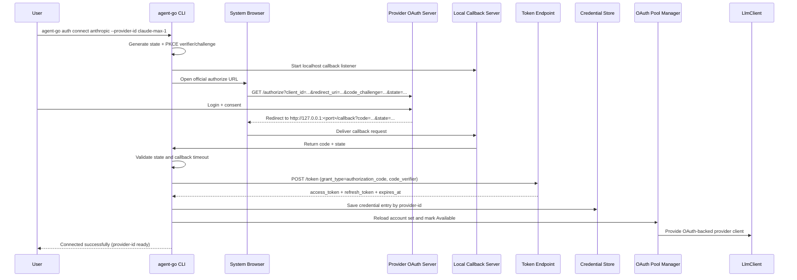

# Agent Go Reimplementation Plan (Resume-Oriented)

## Goal

Reimplement a simplified but high-signal version of the Loom agent in Go while preserving the same
architecture highlights discussed earlier:

- Event-driven explicit state machine
- Trait/interface-based LLM abstraction
- SSE streaming normalization
- Tool registry with JSON schema
- Workspace security boundary and retry reliability

This plan is intentionally scoped so it can be completed in a few days and explained clearly in a
resume or interview.

---

## Scope and Non-Goals

### In Scope

1. CLI-based agent loop (REPL style)
2. Single provider integration (Anthropic first)
3. Streaming and non-streaming completion
4. Tool execution with 2-3 core tools (`read_file`, `list_files`, `edit_file`)
5. Path validation to prevent traversal outside workspace
6. Structured logging and bounded retry
7. MCP client-side server management (Claude Code-like) with dynamic remote tool import
8. ACP mode over stdio JSON-RPC for IDE-driven sessions

### Out of Scope (for v1)

1. Multi-provider production routing/proxy
2. Full auth/ABAC system
3. Kubernetes/weaver/deployment platform work
4. Large observability platform (crash analytics, product analytics UI)
5. Implementing our own MCP server endpoint (this design focuses on MCP client behavior)
6. ACP authentication methods and non-text multimodal content blocks

---

## Recommended Go Libraries

### Core Runtime

- `cobra` for CLI commands and entrypoint
- Go stdlib `context`, `goroutine`, `channel` for async orchestration

### HTTP and Reliability

- `go-resty/resty/v2` for provider HTTP calls
- `cenkalti/backoff/v4` for exponential backoff retries

### Serialization and Validation

- stdlib `encoding/json`
- `go-playground/validator/v10` for input argument validation
- `invopop/jsonschema` to generate tool JSON schema definitions

### Logging and Testing

- `uber-go/zap` for structured logs
- `stretchr/testify` for unit tests
- `leanovate/gopter` (optional) for property-based tests

### Utility

- `google/uuid` for call IDs and correlation IDs

### MCP Client Integration

- `go.bug.st/serial` (optional) only if a transport requires low-level process/pipe handling
- stdlib `os/exec`, `bufio`, `io`, `sync` for stdio-based MCP transport
- stdlib `net/http` (or `resty`) for streamable HTTP transport

---

## Architecture Mapping (Rust Design -> Go Design)

- `loom-core` -> `internal/core`
  - `LlmClient` interface
  - `AgentState`, `AgentEvent`, `AgentAction`
  - `HandleEvent(event) -> action`
- `loom-llm-anthropic` -> `internal/llm/anthropic`
  - `Complete()` and `CompleteStreaming()`
  - SSE parser and event normalization
- `loom-tools` -> `internal/tools`
  - `Tool` interface + `Registry`
  - `read_file`, `list_files`, `edit_file`
  - workspace root path guard
- `loom-cli` -> `cmd/agent` + `internal/runtime`
  - REPL, action dispatcher, event loop
- `mcp-system` (conceptual client role) -> `internal/mcp`
  - MCP server lifecycle manager (add/remove/list/reconnect)
  - JSON-RPC request/response client
  - transport adapters (stdio first, streamable HTTP optional)
  - remote tool -> local tool bridge with namespacing
- `acp-system` -> `internal/acp`
  - ACP agent implementation over stdio JSON-RPC
  - session lifecycle (`initialize`, `session/new`, `session/load`, `session/prompt`, `session/cancel`)
  - protocol bridge between ACP content blocks and internal message/tool events

Layer rule: lower-level packages do not depend on upper-level packages.

---

## v1 Repository Layout

```text
agent-go/
  cmd/agent/main.go
  internal/core/
    agent.go
    state.go
    event.go
    action.go
    llm.go
    error.go
  internal/llm/anthropic/
    client.go
    stream.go
    types.go
  internal/tools/
    tool.go
    registry.go
    context.go
    path_guard.go
    read_file.go
    list_files.go
    edit_file.go
  internal/runtime/
    loop.go
  internal/mcp/
    manager.go
    client.go
    registry_bridge.go
    types.go
    transport_stdio.go
    transport_http.go
    config.go
  internal/acp/
    agent.go
    session.go
    bridge.go
    notify.go
    error.go
    transport_stdio.go
  go.mod
```

---

## MCP Client Manager Design (Claude Code-like)

### Design Intent

This project adds MCP in the same role as Claude Code:

1. The Go agent acts as an MCP client
2. It manages connections to external MCP servers (for example, Figma MCP)
3. It imports remote MCP tools and exposes them to the LLM as callable tools
4. It forwards tool calls to the corresponding MCP server and returns normalized outputs

This is intentionally different from implementing an MCP server endpoint.

### Capabilities

1. Register multiple MCP servers from config
2. Connect and initialize each server on startup
3. List available remote tools and map them into local registry
4. Route `tools/call` requests to correct MCP backend
5. Health-check, retry, and reconnect failed MCP sessions
6. Enable/disable servers without changing core agent logic

### Configuration Model

Use a user-level configuration file (for example, `~/.agent/config.yaml`):

```yaml
mcpServers:
  figma:
    enabled: true
    transport: stdio
    command: "npx"
    args: ["-y", "@modelcontextprotocol/server-figma"]
    env:
      FIGMA_ACCESS_TOKEN: "${FIGMA_ACCESS_TOKEN}"
    startup_timeout_secs: 20
    call_timeout_secs: 30
  internaldocs:
    enabled: false
    transport: http
    url: "http://127.0.0.1:8765/mcp"
    headers:
      Authorization: "Bearer ${MCP_TOKEN}"
```

Server entry fields:

- `name` (map key)
- `enabled`
- `transport` (`stdio` or `http`)
- transport-specific connection fields
- per-server timeouts and retry policy
- optional allowlist for tools

### Tool Namespacing and Registry Bridge

Remote MCP tools must be namespaced to avoid collisions:

- Local native tool: `read_file`
- MCP imported tool: `mcp.figma.get_file`

Bridge behavior:

1. `tools/list` from each MCP server
2. Convert MCP input schema into local `ToolDefinition`
3. Prefix tool name with `mcp.<server>.`
4. Register as a delegating proxy tool

When invoked, proxy tool extracts server+tool name and dispatches `tools/call`.

### MCP Lifecycle Flow

1. Agent startup loads config
2. Manager starts all `enabled` servers
3. For each server: `initialize` -> `notifications/initialized` -> `tools/list`
4. Bridge registers remote tools into main ToolRegistry
5. Runtime loop can now call MCP tools exactly like native tools

### Runtime Call Flow

1. LLM emits tool call for `mcp.figma.some_tool`
2. ToolRegistry resolves to MCP proxy tool
3. MCP manager sends JSON-RPC `tools/call` to `figma` session
4. Result normalized into existing tool output format
5. Agent continues normal state transition

### Reliability and Recovery

1. Startup retry with bounded exponential backoff
2. Per-call timeout and cancellation via context
3. Automatic reconnect on broken transport
4. Circuit-breaker style temporary disable after repeated failures
5. Surface health in CLI via command (for example, `/mcp status`)

### Security Model

1. Env var interpolation occurs at runtime and values are redacted in logs
2. Optional command allowlist for stdio servers
3. Optional tool allowlist per server
4. No automatic trust of server-declared tool schemas beyond validation checks
5. Audit events for connect/disconnect/tool-call operations

### CLI UX (Claude Code-like)

Provide lightweight management commands:

- `/mcp list` - list configured servers and status
- `/mcp add <name> ...` - add a server config entry
- `/mcp remove <name>` - remove server config
- `/mcp enable <name>` / `/mcp disable <name>`
- `/mcp reconnect <name>`
- `/mcp tools [name]` - inspect imported tools

These commands manage client-side connections only; they do not require changes to core state
machine design.

### Minimal MCP Protocol Surface

For v1 MCP client support, implement only:

1. `initialize`
2. `notifications/initialized`
3. `tools/list`
4. `tools/call`

Skip resources/prompts/sampling and server-initiated notifications for the first iteration.

### Core Interfaces (Go)

```go
type MCPManager interface {
    StartAll(ctx context.Context) error
    StopAll(ctx context.Context) error
    ListServers() []ServerStatus
    CallTool(ctx context.Context, server string, tool string, args map[string]any) (ToolResult, error)
    ListImportedTools() []ImportedTool
}

type MCPTransport interface {
    Send(ctx context.Context, req JsonRpcRequest) (JsonRpcResponse, error)
    Close() error
}
```

### Testing Plan for MCP Module

1. Unit tests for JSON-RPC serialization/parsing
2. Unit tests for namespacing and registry bridge mapping
3. Unit tests for reconnect and timeout behavior with fake transport
4. Integration test with a mock stdio MCP server process
5. End-to-end test: imported MCP tool appears in tool list and executes successfully

---

## OAuth Connect and LLM Client Integration

### Design Intent

Support an explicit `connect oauth` flow that opens the provider's official login page, stores
tokens locally, and then activates provider OAuth mode (single account or pool) for `LlmClient`.

### OAuth Connect Sequence (Authorization Code + PKCE)



### Device Code Fallback (Headless)

When browser callback is unavailable (remote SSH/headless), support device flow fallback:

1. CLI requests device code from OAuth server
2. CLI prints `verification_uri` + `user_code`
3. user completes login in external browser
4. CLI polls token endpoint until approved/expired
5. token is stored the same way as browser flow

### Credential Storage and Pool Activation

Store credentials in one JSON map keyed by provider ID:

```json
{
  "claude-max-1": {
    "type": "oauth",
    "refresh": "rt_...",
    "access": "at_...",
    "expires": 1735500000000
  }
}
```

Activation behavior:

1. if exactly one OAuth provider configured -> single OAuth client mode
2. if multiple provider IDs configured -> OAuth pool mode with failover
3. pool and client implementation still satisfy the same `LlmClient` interface

### Request Path After Connect

1. runtime sends `complete`/`complete_streaming` to `LlmClient`
2. OAuth auth injector adds provider-specific auth material (token/headers/prefix)
3. request executes with token refresh when needed
4. classifier handles errors:
   - transient -> retry same account
   - quota exhausted -> cooldown + failover (pool mode)
   - permanent auth error -> disable account and surface action

### Provider-Specific Adapter Pattern

Use a shared OAuth framework with provider adapters:

1. shared: PKCE/state handling, callback listener, token exchange, secure persistence
2. provider adapter: auth header format, extra required headers, system-prompt constraints,
   quota-error classification

This allows OpenAI OAuth or other provider OAuth without changing core agent/runtime APIs.

### OpenAI OAuth / Other Provider OAuth Extension

Add provider entries with the same connect pipeline:

1. `agent-go auth connect openai --provider-id openai-work-1`
2. provider adapter defines authorize/token endpoints and request auth injection
3. optional provider-specific pool strategy and error classification rules
4. `LlmService` chooses provider client from the same `LlmClient` contract

### Security and UX Requirements

1. never log access/refresh tokens
2. redact secrets in debug output
3. bind callback listener to localhost only
4. enforce short callback timeout and state validation
5. provide clear reconnect command when refresh fails (`agent-go auth reconnect <provider-id>`)

---

## ACP IDE Integration Design

### Design Intent

ACP support allows the Go agent to run as an IDE-driven backend process, similar to editor
integration patterns used by Zed/VSCode ACP clients:

1. IDE acts as ACP client
2. `agent-go` runs `acp-agent` mode over stdio
3. IDE sends prompts/sessions via JSON-RPC
4. Agent streams updates (text chunks and tool lifecycle events) back to IDE

This keeps core agent logic shared between REPL mode and IDE mode.

### ACP Capabilities to Implement (v1)

1. `initialize`
2. `session/new`
3. `session/load`
4. `session/prompt`
5. `session/cancel`

Authentication can remain no-op in v1 if agent is launched locally by the IDE.

### ACP Session Model

Use the same mapping pattern as Loom:

- `SessionID` maps directly to persisted `ThreadID`

Per-session state should include:

1. `threadID`
2. `workspaceRoot`
3. `messages` (conversation context)
4. `cancelled` flag

Session lifecycle:

1. `session/new` creates thread and initial state
2. `session/load` restores thread and conversation history
3. `session/prompt` runs prompt loop and streams updates
4. `session/cancel` marks cancellation and aborts in-flight operations

### Prompt Loop in ACP Mode

The ACP prompt loop reuses existing runtime/state-machine behavior:

1. Convert ACP content blocks to internal user message
2. Call LLM in streaming mode
3. Stream text deltas as ACP `session/update`
4. Execute tool calls and stream tool start/finish notifications
5. Append tool results to conversation
6. Continue until end-turn/no-more-tools
7. Persist thread/session state
8. Return ACP prompt response with mapped stop reason

### Protocol Mapping

1. ACP `ContentBlock::Text` -> internal `Message::User`
2. Internal `TextDelta` -> ACP `AgentMessageChunk`
3. Internal tool start/finish -> ACP tool update notifications
4. Internal stop reason -> ACP stop reason:
   - normal completion -> `EndTurn`
   - cancelled -> `Cancelled`
   - processing failure -> `Error`

### ACP Transport and Runtime

Implement stdio JSON-RPC transport for `acp-agent` subcommand:

1. Start ACP connection over stdin/stdout
2. Run a notification sender task for asynchronous `session/update`
3. Keep session state in an in-memory map keyed by session ID
4. Persist threads after each completed turn

### CLI Integration

Add new command mode:

- `agent-go acp-agent`

Behavior:

1. Initialize LLM client, ToolRegistry, ThreadStore, MCP manager
2. Start ACP stdio loop
3. Process ACP session methods until shutdown

### ACP + MCP Integration

ACP and MCP connect at the tool layer:

1. On session startup, initialize MCP manager (global or per-session policy)
2. Import remote MCP tools into ToolRegistry as `mcp.<server>.<tool>`
3. During ACP prompt handling, tool calls can target local or MCP-backed tools transparently
4. IDE remains protocol-focused (ACP); MCP details are hidden behind tool invocation

This gives an IDE experience similar to Claude Code: editor drives conversation while external MCP
servers extend available capabilities.

### ACP Security and Reliability Notes

1. Enforce per-request timeout and cancellation checks in prompt/tool loops
2. Redact sensitive config/env values in logs
3. Validate ACP request payloads before conversion
4. Avoid holding mutable session borrows across blocking/async boundaries
5. Persist session after each completed turn to support crash recovery

### ACP Testing Plan

1. Unit tests for content-block conversion and stop-reason mapping
2. Unit tests for session ID <-> thread ID mapping
3. Integration test for `new_session -> prompt -> streaming updates -> prompt response`
4. Integration test for cancellation behavior
5. Integration test for ACP prompt using MCP-imported tool

---

## Thread Persistence Design (Loom-aligned)

### Design Intent

Adopt Loom's thread persistence philosophy directly:

1. Thread is the source-of-truth conversation document
2. Persist locally first on every completed inferencing turn
3. Sync remotely in best-effort background mode
4. Keep private threads strictly local

This design supports reliable resume, ACP session continuity, and optional multi-device sync.

### Thread Data Model

Use a full snapshot model close to Loom:

1. `id` (prefixed, time-sortable thread ID)
2. `version` (monotonic optimistic concurrency value)
3. timestamps (`created_at`, `updated_at`, `last_activity_at`)
4. execution context (`workspace_root`, `cwd`, `agent_version`)
5. provider context (`provider`, `model`)
6. `conversation.messages`
7. `agent_state` snapshot
8. privacy/sharing flags (`visibility`, `is_private`, `is_shared_with_support`)
9. metadata (`title`, `tags`, `is_pinned`, `extra`)

Suggested ID format:

- `T-<uuid7>`

This preserves chronological sorting and global uniqueness.

### Persistence Triggers

Persist thread at two exact points:

1. **Turn Complete**: when runtime returns to waiting-for-input after user prompt + LLM + tool
   execution chain
2. **Graceful Shutdown**: on explicit exit, EOF, or signal-driven shutdown path

On each persist:

1. update thread from latest runtime state
2. increment `version`
3. refresh `updated_at` and `last_activity_at`
4. save via `ThreadStore`

### Local Storage (Offline-First)

Store thread files under XDG-compatible paths:

- `$XDG_DATA_HOME/agent-go/threads/<thread_id>.json`
- pending sync queue: `$XDG_STATE_HOME/agent-go/sync/pending.json`

Local write requirements:

1. atomic write (`.tmp` then rename)
2. JSON serialization with strict schema compatibility
3. list ordered by `last_activity_at` descending

### Thread Store Layers

Use layered store abstraction:

1. `LocalThreadStore` (load/save/list/delete/search)
2. `SyncingThreadStore` (wraps local store + optional remote sync client)

Save behavior in `SyncingThreadStore`:

1. always save locally first
2. if `is_private == true`, skip sync
3. otherwise sync asynchronously in background
4. on sync failure, enqueue pending operation for retry

### Pending Sync Queue

Persist failed sync operations so they survive process restarts.

Entry fields:

1. `thread_id`
2. `operation` (`upsert` or `delete`)
3. `failed_at`
4. `retry_count`
5. `last_error`

Queue behavior:

1. deduplicate by `(thread_id, operation)`
2. increment retry count on repeated failures
3. remove entry on successful retry

### Remote Sync API Contract

Keep REST contract compatible with Loom-style thread sync:

1. `PUT /v1/threads/{id}` (upsert)
2. `GET /v1/threads/{id}`
3. `GET /v1/threads` (paged list)
4. `DELETE /v1/threads/{id}` (soft delete)

Concurrency:

- use `If-Match` with local `version`
- return conflict on stale write

v1 conflict handling can be conservative:

1. surface conflict in logs/status
2. keep local copy intact
3. optionally provide manual resolution command later

### Privacy and Visibility Rules

Hard invariant:

- if `thread.is_private == true`, never send this thread to remote server

This must be enforced in store logic (not only in CLI command validation).

Visibility semantics for synced threads:

1. `organization`
2. `private`
3. `public`

Support-share flag:

- `is_shared_with_support` independent from visibility

### CLI Commands for Threads

Expose thread management commands:

1. `agent-go` (new thread)
2. `agent-go list`
3. `agent-go resume [thread_id]`
4. `agent-go search <query>`
5. `agent-go private`
6. `agent-go share [thread_id] --visibility ...`
7. `agent-go share [thread_id] --support`

### ACP Integration with Threads

ACP session mapping should follow Loom pattern:

- `SessionID == ThreadID`

Effects:

1. `session/new` creates a thread-backed session
2. `session/load` restores thread and conversation state
3. `session/prompt` appends messages and persists at turn completion
4. `session/cancel` does not discard persisted history

### MCP Integration with Threads

Record MCP context in thread metadata for reproducibility:

1. configured MCP server names
2. optional tool namespace used in the turn
3. optional per-turn MCP call summary (non-secret)

Do not persist secrets/tokens in thread documents.

### Go Module Layout (Thread Subsystem)

```text
internal/thread/
  model.go
  store.go
  local_store.go
  sync_store.go
  sync_client.go
  pending_queue.go
  error.go
```

Core interfaces:

```go
type ThreadStore interface {
    Load(ctx context.Context, id ThreadID) (*Thread, error)
    Save(ctx context.Context, thread *Thread) error
    List(ctx context.Context, limit int) ([]ThreadSummary, error)
    Delete(ctx context.Context, id ThreadID) error
    Search(ctx context.Context, query string, limit int) ([]ThreadSummary, error)
}
```

### Testing Plan for Thread System

1. roundtrip serialization tests for `Thread`
2. thread ID format/property tests (`T-` prefix + UUID7)
3. local store save/load/list/delete tests
4. private thread never-sync invariant tests
5. pending queue dedup/retry tests
6. sync conflict handling tests
7. integration: runtime turn completion triggers save

---

## Core Functional Design

### 1. Explicit State Machine

Primary states (same intent as previous design):

1. `WaitingForUserInput`
2. `CallingLlm`
3. `ProcessingLlmResponse`
4. `ExecutingTools`
5. `Error`
6. `ShuttingDown`

Primary event/action contract:

- Input: `HandleEvent(event)`
- Output: `AgentAction`
- State machine itself does not perform I/O
- Runtime executes action, then feeds follow-up events back

Benefits:

- Deterministic and testable transitions
- Clear error and retry lifecycle
- Easier interview explanation (problem -> transition table -> invariants)

### 2. LLM Interface and Provider Strategy

Define one interface:

- `Complete(ctx, request) (response, error)`
- `CompleteStreaming(ctx, request) (<-chan LlmEvent, error)`

Start with Anthropic implementation only.

Design still supports future providers by implementing the same interface.

### 3. SSE Event Normalization

Normalize provider stream into one event union:

1. `TextDelta`
2. `ToolCallDelta`
3. `Completed`
4. `Error`

Tool call JSON fragments are accumulated in memory and parsed only when complete.

### 4. Tool System

Tool interface includes:

- `Name()`
- `Description()`
- `InputSchema()`
- `Invoke(ctx, args, toolCtx)`

Registry behavior:

- Register tool by name
- List definitions for model tool registration
- Dispatch invocation by tool name

v1 tools:

1. `read_file`
2. `list_files`
3. `edit_file`

### 5. Security Boundary

All file paths must be validated against `workspaceRoot`:

1. Resolve absolute path
2. Canonicalize path
3. Ensure canonical path has workspace canonical prefix
4. Reject otherwise

This prevents traversal and symlink escape attacks.

### 6. Reliability

- Bounded retries with exponential backoff for transient LLM/API errors
- Context-driven cancellation for long calls and stream operations
- Structured logging with request ID, state, and tool name fields

---

## Minimal Delivery Milestones

### Milestone 1 - Core and Contracts

- Build core types and transition skeleton
- Add transition table tests

### Milestone 2 - Anthropic Client

- Implement `Complete` and `CompleteStreaming`
- Normalize SSE events and verify accumulation behavior

### Milestone 3 - Tools and Runtime

- Implement registry and three tools
- Wire REPL runtime: user input -> state machine -> action -> event loop

### Milestone 4 - Hardening

- Add retry policies and path guard tests
- Add integration test with mocked LLM client

### Milestone 5 - MCP Client Manager

- Implement MCP config loading and manager lifecycle
- Support stdio transport and basic JSON-RPC methods
- Import remote tools with `mcp.<server>.` namespacing
- Add `/mcp` CLI management commands
- Add integration tests using mock MCP server

### Milestone 6 - ACP IDE Mode

- Add `acp-agent` CLI subcommand and stdio JSON-RPC transport
- Implement ACP session lifecycle handlers (`initialize/new/load/prompt/cancel`)
- Stream message/tool updates back to IDE clients
- Persist/reload session context through thread store
- Validate ACP + MCP tool routing in integration tests

### Milestone 7 - Thread Persistence and Sync

- Implement `internal/thread` model and store interfaces
- Add XDG-based local thread storage with atomic writes
- Trigger saves on turn completion and graceful shutdown
- Add optional sync client and pending queue retry path
- Add private-thread sync guard and visibility/share metadata handling

---

## Resume-Focused Highlights

Use wording similar to the following:

1. Designed an event-driven agent state machine in Go, separating deterministic transition logic
   from asynchronous I/O execution for improved testability and reliability.
2. Implemented Anthropic SSE streaming with normalized event types and incremental tool-argument
   reconstruction.
3. Built an interface-based LLM provider abstraction and dynamic tool registry with JSON schema
   contracts.
4. Enforced workspace filesystem boundaries and added retry/backoff handling for resilient tool and
   LLM orchestration.
5. Implemented a Claude Code-like MCP client manager that connects to external MCP servers and
   dynamically imports remote tools into the local agent tool registry.

---

## Interview Narrative (Quick)

1. Start with the problem: agent systems mix conversational state, streaming, and side effects.
2. Explain architecture choice: explicit state machine + action dispatcher.
3. Show reliability/security: backoff retries + workspace path guard.
4. Show extensibility: provider interface + tool registry.
5. Show ecosystem integration: MCP client manager with namespaced remote tools.
6. End with outcomes: simple codebase, clear tests, and easy feature growth.

---

## Suggested Timeline

- Day 1: core state machine and tests
- Day 2: Anthropic complete + streaming parser
- Day 3: tool registry + tools + runtime wiring
- Day 4: reliability hardening and integration tests
- Day 5: MCP manager, stdio transport, tool import bridge, and `/mcp` commands

This timeline keeps scope realistic while preserving architecture depth for resume and interviews.
