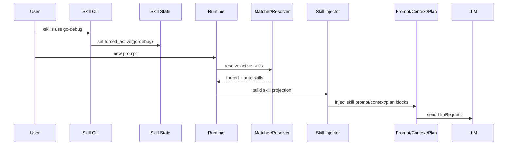

# Agent Go Skill System Implementation Checklist

## Goal

Implement an activation-first skill system where:

1. explicit user activation is guaranteed (100% for installed valid skills)
2. runtime auto-activation can enable relevant skills implicitly
3. active skills inject prompt/context/plan guidance before each `LlmRequest`

## Design Boundary

Skill layer sits above tool execution:

1. tools remain model-callable executable capabilities
2. skills are runtime orchestration bundles (policy/workflow/prompt/context templates)
3. skill activation and precedence are controlled by agent runtime

Skill logic must not mutate canonical thread transcript contents.

## Module Layout

```text
internal/skills/
  manifest.go       # skill manifest schema
  registry.go       # installed skill index and lookup
  matcher.go        # implicit activation scoring
  resolver.go       # final activation set with precedence rules
  state.go          # per-session forced/disabled/auto state
  injector.go       # projection into prompt/context/plan layer
  policy.go         # dependency and trust checks
  errors.go
```

## Skill Manifest Contract

```go
type SkillManifest struct {
    ID               string
    Version          string
    Description      string
    Triggers         []SkillTrigger
    PromptBlocks     SkillPromptBlocks
    ContextHints     []ContextHint
    PlanTemplate     *PlanTemplate
    RequiredTools    []string
    RequiredMcpTools []string
    Priority         int
    EnabledByDefault bool
}

type SkillPromptBlocks struct {
    System      string
    Developer   string
    Constraints []string
}

type SkillTrigger struct {
    Type       string // keyword|regex|intent|path
    Pattern    string
    Weight     int
}
```

## Activation State Model

```go
type ActivationSource string

const (
    ActivationForced        ActivationSource = "forced_active"
    ActivationUserDisabled  ActivationSource = "user_disabled"
    ActivationAutoMatched   ActivationSource = "auto_matched"
    ActivationModelSuggested ActivationSource = "model_suggested"
)

type SkillSessionState struct {
    ForcedSkills   map[string]bool
    DisabledSkills map[string]bool
    LastAutoSkills map[string]float64
}
```

Precedence order is deterministic:

1. `forced_active`
2. `user_disabled`
3. `auto_matched`
4. `model_suggested`

## CLI Commands

Add explicit control commands:

1. `/skills list`
2. `/skills use <skill-id>`
3. `/skills off <skill-id>`
4. `/skills auto on|off`
5. `/skills status`

Command semantics:

1. `/skills use` validates installation and dependencies, then persists `forced_active`
2. `/skills off` removes from forced set and optionally adds to disabled set
3. `/skills auto off` disables implicit matching for the session

## Explicit Activation Guarantee

For installed and valid skills, explicit activation must always be applied.

Guarantee path:

1. command parses and validates manifest
2. dependency policy validates required tools and MCP tools
3. runtime writes `forced_active` state
4. resolver always includes forced skills in every request until disabled

If dependency validation fails, command must return actionable error and not partially apply.

## Implicit Activation Flow

Matcher scores installed skills each turn using:

1. current user message
2. recent conversation context
3. current plan snapshot
4. workspace hints (optional)

Only skills above threshold and not disabled are candidates for resolver.

## End to End Sequence



## Resolver Pseudocode

```go
func ResolveActiveSkills(
    installed []SkillManifest,
    state SkillSessionState,
    autoCandidates map[string]float64,
    modelSuggestions []string,
) []ResolvedSkill {
    resolved := map[string]ResolvedSkill{}

    for id := range state.ForcedSkills {
        resolved[id] = ResolvedSkill{ID: id, Source: ActivationForced}
    }

    for id := range state.DisabledSkills {
        delete(resolved, id)
    }

    for id, score := range autoCandidates {
        if state.DisabledSkills[id] {
            continue
        }
        if _, exists := resolved[id]; exists {
            continue
        }
        if score >= 0.70 {
            resolved[id] = ResolvedSkill{ID: id, Source: ActivationAutoMatched, Score: score}
        }
    }

    for _, id := range modelSuggestions {
        if state.DisabledSkills[id] {
            continue
        }
        if _, exists := resolved[id]; exists {
            continue
        }
        resolved[id] = ResolvedSkill{ID: id, Source: ActivationModelSuggested}
    }

    return SortByPriorityAndSpecificity(installed, resolved)
}
```

## Injection Pseudocode

```go
func InjectSkills(
    reqCtx RequestContext,
    active []ResolvedSkill,
    registry SkillRegistry,
) (RequestContext, error) {
    for _, s := range active {
        manifest, ok := registry.Get(s.ID)
        if !ok {
            return reqCtx, fmt.Errorf("skill not installed: %s", s.ID)
        }

        reqCtx.Prompt = MergePromptBlocks(reqCtx.Prompt, manifest.PromptBlocks)
        reqCtx = ApplyContextHints(reqCtx, manifest.ContextHints)
        reqCtx = ApplyPlanTemplate(reqCtx, manifest.PlanTemplate)
        reqCtx.Metadata.ActiveSkills = append(reqCtx.Metadata.ActiveSkills, s.ID)
    }

    reqCtx.Metadata.PromptHash = HashPrompt(reqCtx.Prompt)
    return reqCtx, nil
}
```

## Policy and Safety Rules

1. no skill can bypass workspace path guards or tool authz
2. required tool dependencies must be validated before activation
3. required MCP tool namespace must exist before activation
4. missing dependency must produce explicit error or graceful skip (configurable)
5. never persist expanded prompt text into canonical transcript

## Logging and Telemetry

Emit structured fields per request:

1. `thread_id`
2. `active_skills`
3. `skill_activation_sources`
4. `auto_match_scores`
5. `prompt_hash`
6. `skill_dependency_failures`

Never log secret values from skill manifests or env interpolation.

## Thread Persistence Integration

Thread stores only minimal skill metadata:

1. `active_skill_ids` at turn completion
2. optional per-turn applied skill IDs in metadata
3. activation source summary (`forced`, `auto`, `model`)

Do not store full injected prompt blocks.

## Testing Checklist

1. explicit `/skills use` always activates installed valid skill
2. explicit activation persists across multiple turns until `/skills off`
3. disabled skill is never auto-activated
4. auto matcher threshold and precedence behavior are deterministic
5. forced skill wins on conflict with auto or model suggestions
6. dependency failure returns actionable error on explicit activation
7. skill injection updates prompt hash deterministically
8. missing manifest prevents activation and reports error
9. thread metadata stores skill IDs but not expanded prompt content
10. integration test with MCP-required skill when MCP tool is missing/present

## Milestones

1. M1: manifest, registry, and explicit command path
2. M2: resolver precedence and state persistence
3. M3: runtime injector integration with prompt/context/plan
4. M4: implicit matcher and threshold tuning
5. M5: hardening tests and observability
