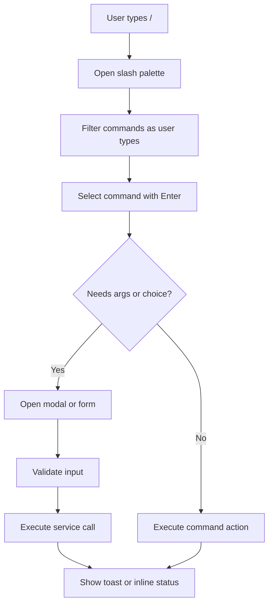
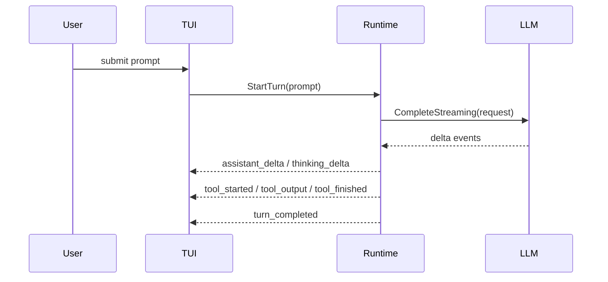

# Agent Go Minimal TUI Implementation Checklist

## Goal

Deliver a Go-native minimal TUI where:

1. `agent-go` (no subcommand) enters TUI directly
2. cobra subcommands (`agent-go thread`, `agent-go resume`, etc.) remain available
3. runtime-normalized streaming and tool events are rendered live in TUI
4. slash command palette drives modal/form workflows for model, mcp, skills, and thread commands

## Entry Routing Contract

CLI routing rules:

1. `agent-go` -> start TUI shell
2. `agent-go <subcommand>` -> execute cobra subcommand
3. `agent-go acp-agent` -> ACP stdio mode (unchanged)

### Entry Router Pseudocode

```go
func runRoot(cmd *cobra.Command, args []string) error {
    if len(args) == 0 {
        return tui.RunDefaultShell()
    }
    return runCobraSubcommand(cmd, args)
}
```

## Minimal TUI Stack

Recommended libraries:

1. `bubbletea` for update/view loop
2. `bubbles` for text input, list, viewport, help
3. `lipgloss` for layout and styles

## Runtime to TUI Boundary

Keep orchestration in runtime; keep presentation in TUI.

1. runtime executes LLM/SSE/tool flow
2. runtime emits normalized events on a channel
3. TUI subscribes and updates panel state

No tool execution or provider calls should happen directly inside TUI components.

## Runtime Event Protocol

```go
type RuntimeEventKind string

const (
    EventAssistantDelta   RuntimeEventKind = "assistant_delta"
    EventThinkingDelta    RuntimeEventKind = "thinking_delta"
    EventToolStarted      RuntimeEventKind = "tool_started"
    EventToolOutput       RuntimeEventKind = "tool_output"
    EventToolFinished     RuntimeEventKind = "tool_finished"
    EventTurnCompleted    RuntimeEventKind = "turn_completed"
    EventTurnError        RuntimeEventKind = "turn_error"
    EventStatusUpdate     RuntimeEventKind = "status_update"
)

type RuntimeEvent struct {
    Kind        RuntimeEventKind
    ThreadID    string
    TurnID      string
    TimestampMs int64
    Payload     map[string]any
}
```

### Payload Shape Guidance

1. `assistant_delta`: `{ "text": "..." }`
2. `thinking_delta`: `{ "text": "...", "visibility": "collapsed|expanded" }`
3. `tool_started`: `{ "call_id": "...", "tool": "read_file", "args_preview": "..." }`
4. `tool_output`: `{ "call_id": "...", "chunk": "..." }`
5. `tool_finished`: `{ "call_id": "...", "ok": true, "duration_ms": 120 }`
6. `turn_error`: `{ "message": "...", "retryable": false }`

## TUI Layout (Minimal)

Use a 4-region layout:

1. header/status strip (model, thread id, mode)
2. conversation viewport (user + assistant stream)
3. side or bottom activity panel (thinking + tool lifecycle)
4. input line (supports plain message or slash command)

## Slash Command Surface

Minimum slash commands:

1. `/help`
2. `/model`
3. `/mcp`
4. `/skills`
5. `/thread`
6. `/quit`

Slash commands should map to shared service calls used by cobra handlers.

## Slash Interaction Flow



## Runtime Streaming Flow



## TUI Model Pseudocode

```go
type Model struct {
    input        textinput.Model
    slash        SlashPalette
    convo        viewport.Model
    activity     viewport.Model
    status       StatusBar
    runtimeCh    <-chan RuntimeEvent
    commandBus   CommandExecutor
}

func (m Model) Update(msg tea.Msg) (tea.Model, tea.Cmd) {
    switch v := msg.(type) {
    case tea.KeyMsg:
        return m.onKey(v)
    case RuntimeEventMsg:
        return m.onRuntimeEvent(v.Event)
    case CommandResultMsg:
        return m.onCommandResult(v)
    }
    return m, nil
}
```

## Slash Dispatch Pseudocode

```go
func (m *Model) executeSlash(cmd SlashSelection) tea.Cmd {
    switch cmd.Name {
    case "model":
        return openModelModalCmd()
    case "mcp":
        return openMcpModalCmd()
    case "skills":
        return openSkillsModalCmd()
    case "thread":
        return openThreadModalCmd()
    case "help":
        return showHelpCmd()
    case "quit":
        return tea.Quit
    default:
        return showErrorCmd("unknown slash command")
    }
}
```

## Shared Service Layer Requirement

To avoid duplicated business logic between TUI and cobra:

1. move command logic into reusable service functions
2. cobra handlers call services
3. TUI slash handlers call the same services

Example:

1. `ModelService.SetActiveModel(...)`
2. `McpService.ListServers(...)`
3. `SkillService.UseSkill(...)`
4. `ThreadService.Resume(...)`

## Error and Retry UX

1. turn errors show in activity panel and status bar
2. retryable failures offer quick action (`r` or slash action)
3. command form validation errors stay inside modal with inline hints

## Observability Fields

Record at least:

1. `ui_mode=tui|cobra`
2. `slash_command`
3. `runtime_event_kind`
4. `thread_id`
5. `turn_id`
6. `command_duration_ms`

## Testing Checklist

1. root entry opens TUI when no subcommand is passed
2. cobra subcommands still execute outside TUI
3. slash palette opens and filters correctly on `/`
4. slash modal flow validates and dispatches command actions
5. assistant delta stream appends incrementally in conversation panel
6. tool lifecycle events render correctly in activity panel
7. thinking events render in separate section and do not block response text
8. runtime turn error renders status and keeps app usable
9. shared services are called by both cobra and TUI paths
10. `/quit` exits cleanly and triggers graceful shutdown path

## Suggested Delivery Steps

1. step 1: root entry routing (`agent-go` -> TUI, subcommands unchanged)
2. step 2: base TUI layout and input handling
3. step 3: runtime event channel integration and streaming render
4. step 4: slash palette and `/help` plus `/quit`
5. step 5: modal flows for `/model`, `/mcp`, `/skills`, `/thread`
6. step 6: test hardening and UX polish
